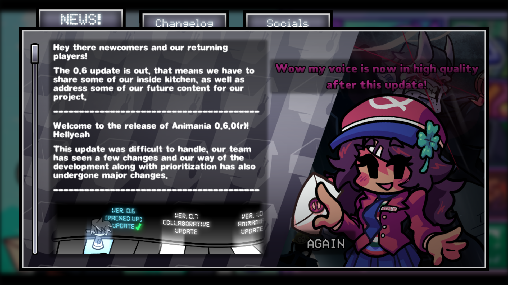
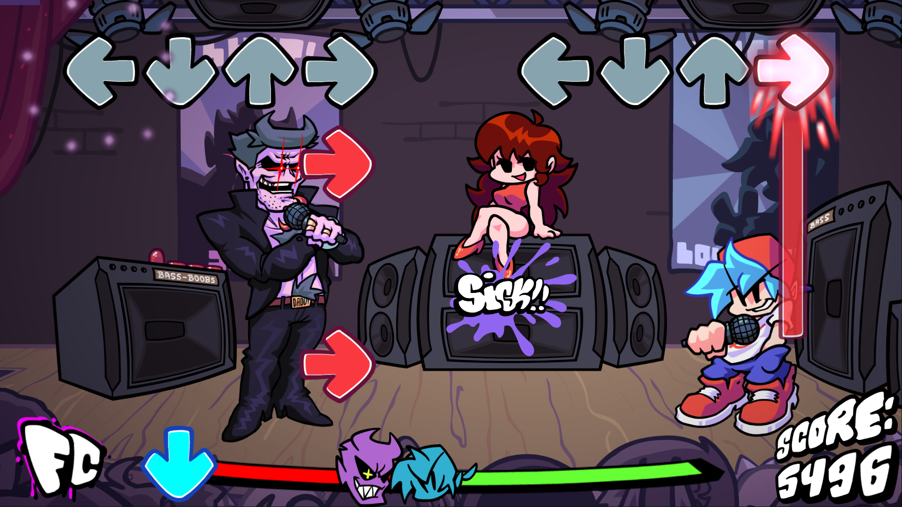
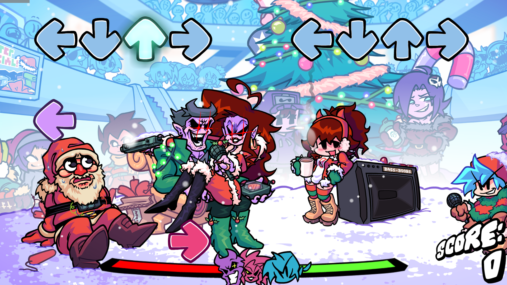
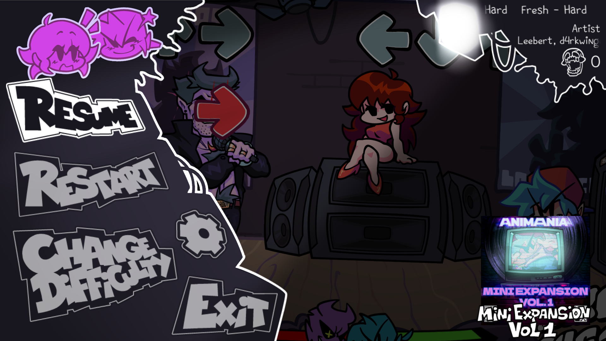
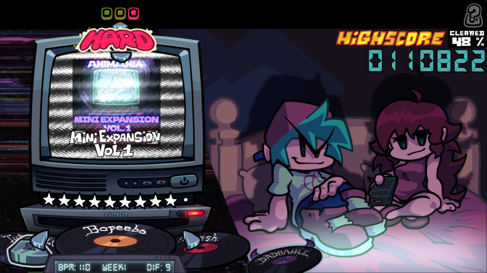
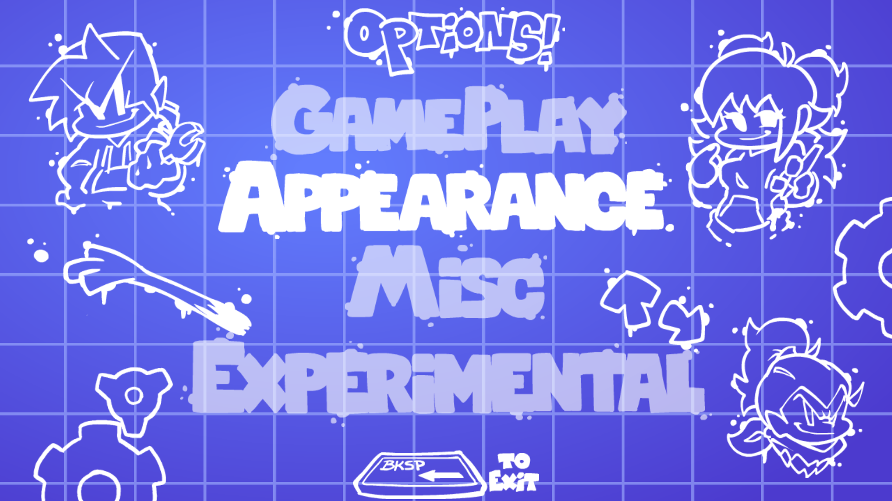

A lot of 0.6.0 changes:

With the 0.6 update, Animania! changed a lot in different places and areas:

--------------------------

Updated News menu with markdown images support.

--------------------------

Added AMTake Week 1 content with a twist!
Awesome sprites with cool effects on top makes me happy.

--------------------------

Updated AMTake Week 5 stages to reduce visual clutter and make stages match the Winter-Horrorlad's stage.

--------------------------

Added new and awesome Pause Menu with ability to change some settings without leaving gameplay!

--------------------------

Reworked and optimized Freeplay menu.

--------------------------

Whole ass new Options menu, where you can change almost everything!

--------------------------

Also some notes that game uses yet another HScript parser for song/state/event scripts for simpler development and etc.
Added cool-ass title bar for Windows builds.
Added funny modchart system.

