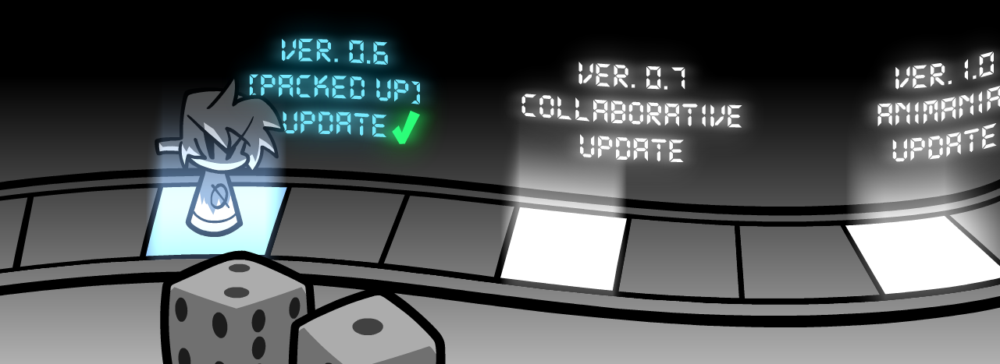
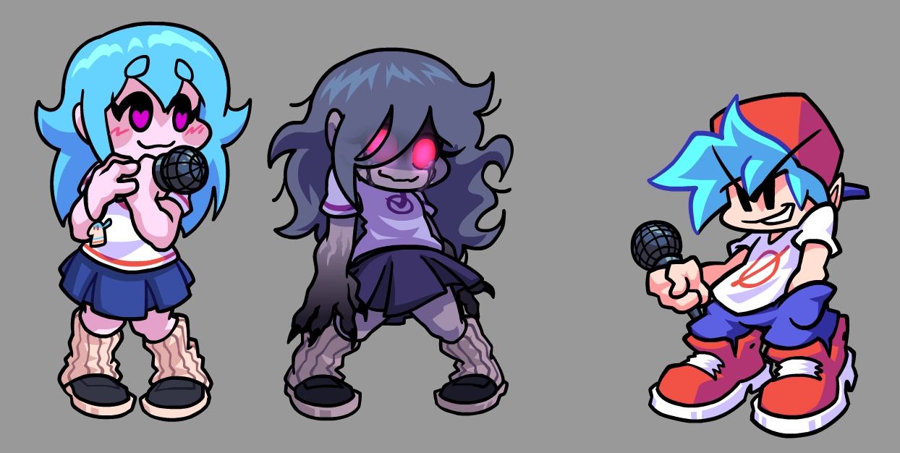
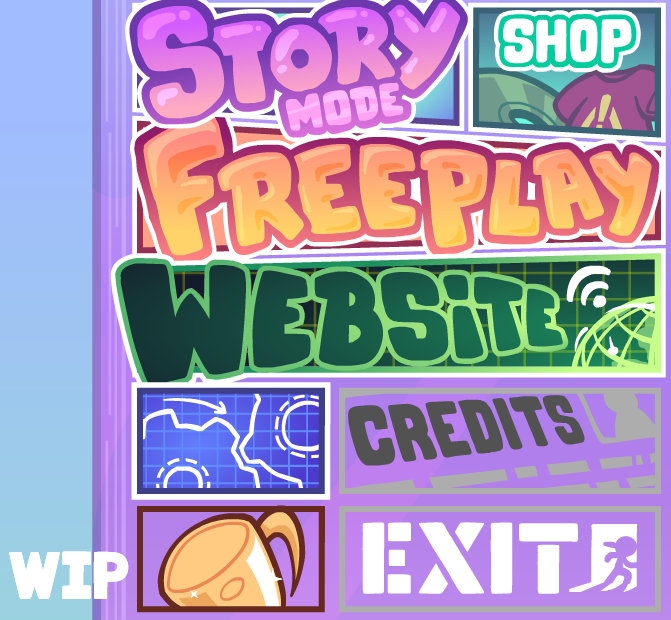
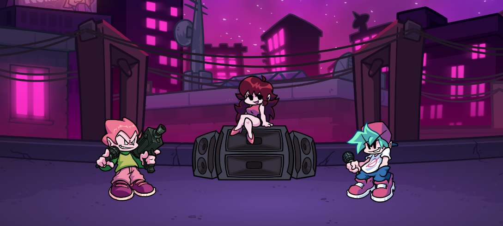
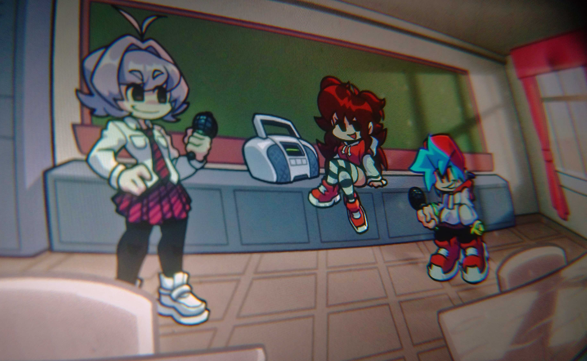

Hey there newcomers and our returning players\!

Also Hi Penkaru!!! I can see you through your beautiful, breakable window.
Joke!

The 0.6 update is out, that means we have to share some of our inside kitchen, as well as address some of our future content for our project.

------------
Welcome to the release of Animania 0.6.0(r)!
Hellyeah

This update was difficult to handle, our team has seen a few changes and our way of the development along with prioritization has also undergone major changes.

--------------------------

So, I can declare with confidence that the next step of our development is going to be...

--------------------------

A COLLABORATIVE UPDATE\!

To be honest, the Sky collab was originally planned for the 0.6 update, but considering the amount of time that we had we realized that this goal was too ambitious, so we decided to move the Sky content to its own update numbered 0.7, while polishing this update with many visual and technical changes.

--------------------------

NEW MAIN MENU

Honestly, we ourselves are really tired of constantly remaking everything in each update, but this time i assure you it's the last time we're doing it.

--------------------------

AMTake

We are considering changing the way we're releasing the levels of our take on FNF. From now on expect us to release some of the new content partially and not in whole weeks. I think this format will allow us to add more unexpected surprises for the fans of AMTake and help us not burn out from constant work on just one thing (Week 5, this is about you\!\!\!)

--------------------------

What's with Animania?

Short answer \- we're working on it. Sadly, this part of the content is not currently in our priority, but nevertheless I can say outright \- FIRST ANIME WEEK (or title 1\) is coming out along with v.1, and from that point onward we are going to focus more on the original content, and not just AMTake.

--------------------------

In conclusion we have some words for our community...\!

Thanks for your kind words, your support, the fact that you never forget about us and patiently wait for our posts and give your feedback.
It's exactly what gives us the strength to work further and delight you with the new updates and improve the already seemingly high quality of our project.

See you soon\!                       \-Animania\!Crew

